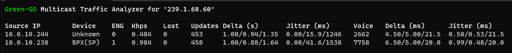

# Green-GO Multicast Traffic Analyzer

This Python terminal application listens to a given multicast address and analyzes the traffic. It can be configured with the multicast and local interface addresses through command line arguments or a configuration file.



> **Disclaimer:** This application is only thought to enable quick analysis. It should not be taken as the "stick of truth" as the displayed statistics can be "skewed" depending on "perspective" (host or network configuration).
>
> Always verify your findings by using additional tooling like packet captures and infrastructure logs.

## Installation

1. [Clone the repository to your local machine](https://docs.github.com/en/repositories/creating-and-managing-repositories/cloning-a-repository).
2. Install [Python](https://wiki.python.org/moin/BeginnersGuide/Download) and [pip](https://pip.pypa.io/en/stable/installation/) on your computer.
3. Install the necessary dependencies:
   - Linux/MacOS: `pip install -r requirements.txt`
   - Windows: `pip install -r requirements-win.txt`

> **Note:** There are also compiled executables in the `/dist` folder if you don't want or can't install Python.

## Usage

### Command Line Arguments

1. multicast_address: Multicast IPv4 address to join and listen to. To find the multicast address for your Green-GO system, simply check the global configuration settings.
2. interface_address: The IPv4 address of the network interface you want to use.

Example:

```
python3 ggo-mta.py 239.0.0.1 192.168.0.101
```

### Interactive Commands

While the application is running, the following key commands are available:

- **q:** Quits the application.
- **r:** Resets all counters and statistics being displayed.
- **s:** Saves the current configuration to the default configuration file.

## Configuration File

If no command line arguments are provided, the application will attempt to load them from a configuration file named `ggo_mta-default.config`. The configuration file should contain a JSON object with the keys `multicast_address` and `interface_address`.

Example of configuration file:

```json
{
  "multicast_address": "239.0.0.1",
  "interface_address": "192.168.0.101"
}
```

> Editing the default configuration enables you to start the program without any command line arguments.

### Loading custom configuration file

You can specify a custom configuration file location with the `-c` or `--config` option:

```
python3 ggo-mta.py -c /path/to/config
```

### Saving Configuration

After running the application with command line arguments, the configuration will be saved to a file using the multicast address in the filename.

For example, a running application using the multicast address of `239.0.0.1` will save the configuration to `ggo_mta-239_0_0_1.config`.

> You can use [command line arguments](#loading-custom-configuration-file) to load your custom configuration.

While the application is running, pressing the `s` key will save the current configuration to the default configuration file (`mta_ggo-default.config`), which can be used to start the application without any command line arguments.

## Subscriber's statistics & UI

Once the application is started, it will display a table with the following headings:

- **Source IP:** The source IP address of the multicast traffic.
- **Device:** The subscriber's type of device (limited support).
- **ENG:** The subscriber's Green-GO engine (some devices feature multiple engines).
- **Kbps:** Subscriber's current bandwidth.
- **Lost:** Lost packets counter.
- **Updates:** Counter for config/update packets.
- **Voice:** Counter for voice stream packages.
- **Delta:** Delta time between packet-to-packet arrivals (current/average/maximum).
- **Jitter:** Jitter calculated by arrival times of latest packets (current/average/maximum).

Each row in the table represents a unique source of multicast traffic. The table is updated in real-time as new packets are received.

## Contact & Support

Please reach out to the [Green-GO community](https://greengoconnect.com) if you need any further support using this application or debugging your network.
